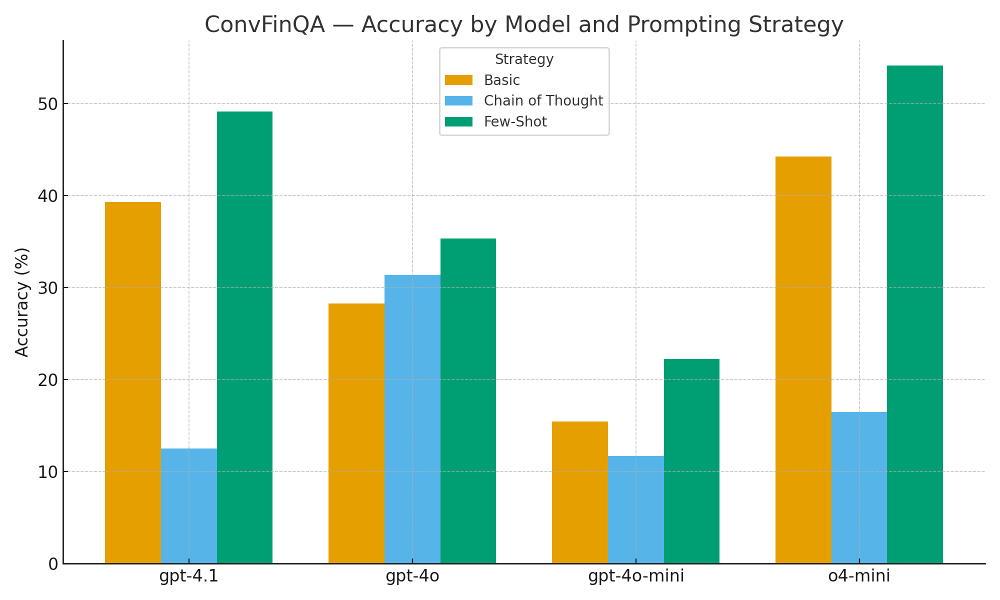
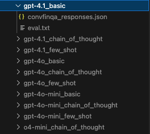
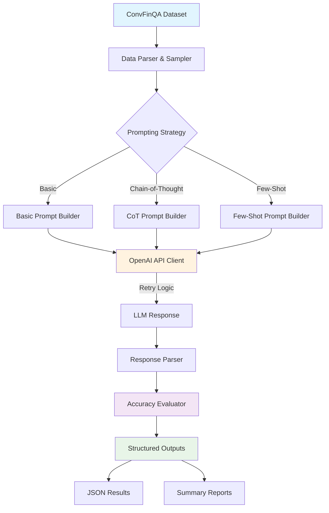

# ConvFinQA Evaluation Pipeline

[](https://www.python.org/downloads/)
[](https://github.com/astral-sh/ruff)
[](https://github.com/python/mypy)
[](https://opensource.org/licenses/MIT)

## Overview

A reproducible evaluation framework for benchmarking Large Language Models on the **ConvFinQA** dataset - a conversational financial question-answering benchmark requiring multi-step reasoning across tabular data.

This pipeline evaluates multiple OpenAI models (`gpt-4.1`, `gpt-4o`, `gpt-4o-mini`, `o4-mini`) using three distinct prompting strategies (`basic`, `chain-of-thought`, `few-shot`) with structured output generation and comprehensive accuracy metrics.

### Key Features

- **Multi-Model Support**: Evaluate OpenAI's latest models with consistent methodology
- **Prompt Engineering**: Compare basic, chain-of-thought, and few-shot learning approaches  
- **Reproducible Results**: Seeded sampling and containerized environment
- **Production Ready**: Type-safe configuration, retry logic, structured logging
- **Comprehensive Testing**: Unit tests with pytest, linting with ruff, type checking with mypy

### Quick Results Summary

| Model       | Best Strategy | Accuracy (%) | Sample Size |
| ----------- | ------------- | ------------ | ----------- |
| **o4-mini** | Few-Shot      | **54.15**    | 20          |
| gpt-4.1     | Few-Shot      | 49.13        | 50          |
| gpt-4o      | Few-Shot      | 35.30        | 50          |
| gpt-4o-mini | Few-Shot      | 22.25        | 50          |

> **Key Insight**: o4-mini significantly outperforms all other models, achieving 54.15% accuracy - over 2x better than gpt-4o-mini and 5% higher than gpt-4.1.

**Performance Comparison**: The chart below shows accuracy across all model-strategy combinations, highlighting Few-Shot learning's consistent superiority and o4-mini's unexpected strong performance.



*Full results and analysis available in [REPORT.md](REPORT.md)*

## Setup

### .env configuration

Firstly, please run the following command, this will enable you to configure your `.env` file with defaults that can be easily replaced.

```bash
cp sample.env .env
```

The below table provides a brief summary of each environment variable 

| Variable            | Default Value                      | Type   | Description                                                            |
| ------------------- | ---------------------------------- | ------ | ---------------------------------------------------------------------- |
| `LOG_LEVEL`         | `INFO`                             | string | Sets the logging verbosity. Options: `DEBUG`, `INFO`, `WARN`, `ERROR`. |
| `OPENAI_API_KEY`    | `your_openai_api_key_here`         | string | Your OpenAI API key used to generate model responses.                  |
| `DATA_PATH`         | `/app/data/convfinqa_dataset.json` | string | Path to the ConvFinQA dataset JSON file.                               |
| `RANDOM_SEED`       | `42`                               | int    | Random seed for reproducible sampling and evaluation.                  |
| `MAX_RETRIES`       | `3`                                | int    | Number of retry attempts for failed API calls.                         |
| `BASE_DELAY`        | `2.0`                              | float  | Initial delay in seconds for exponential backoff.                      |

### Retry Configuration

The system includes exponential backoff retry logic for OpenAI API calls to handle rate limits and transient failures gracefully:

| Variable | Default Value | Type | Description |
|----------|---------------|------|-------------|
| `MAX_RETRIES` | `3` | int | Number of retry attempts for failed API calls |
| `BASE_DELAY` | `2.0` | float | Initial delay in seconds for exponential backoff |

#### Retry Schedule Example

With default settings (MAX_RETRIES=3, BASE_DELAY=2.0):

- **Attempt 1**: Immediate
- **Attempt 2**: Wait 2.0 seconds  
- **Attempt 3**: Wait 4.0 seconds
- **Attempt 4**: Wait 8.0 seconds

#### Retryable Errors

The system automatically retries the following OpenAI API errors:
- Rate limit exceeded (`RateLimitError`)
- API timeout (`APITimeoutError`) 
- General API errors (`APIError`)

Non-retryable errors (authentication, validation) fail immediately.

Configure these values in your `.env` file to handle different API rate limits and usage patterns.

### Configuration Management

The application uses Pydantic v2 for centralized configuration management. All environment variables are loaded and validated through the `Config` class in `app/config.py`. This provides:

- **Type Safety**: All configuration values are type-checked and validated
- **Default Values**: Sensible defaults are provided for all settings
- **Documentation**: Each configuration field includes a description
- **Validation**: Input validation ensures configuration integrity
- **Centralization**: Single source of truth for all application settings

The configuration is automatically loaded from the `.env` file and made available throughout the application via a global `config` instance.

### Directory Initialization

Please run the following command to create an empty outputs directory, this will then be volume mapped inside your container, where it will later be populated with evaluation output files.

```bash
mkdir outputs
```

### Docker

In order to setup this repo, all thats needed are [docker](https://www.docker.com/) and [docker compose](https://docs.docker.com/compose/), these can be installed through the links or through a package manager such as homebrew or apt, for example:

```bash
brew install --cask docker
```

You can verify the installations with

```bash
docker --version
docker compose version
```

Once done, the application can be activated with:

```bash
docker compose up --build -d
```

### Aliases

A series of aliases are provided for convenience and ease of use. To activate these, from the project root run:

```bash
source .aliases
```

These aliases are summarized in the table below


| Alias         | Description                                      | Command                                                                                                                                                                               |
| ------------- | ------------------------------------------------ | ------------------------------------------------------------------------------------------------------------------------------------------------------------------------------------- |
| `format`      | Formats the code using `ruff`.                   | `docker compose exec app uvx ruff format .`                                                                                                                                           |
| `linting`     | Runs linting and auto-fixes issues using `ruff`. | `docker compose exec app uvx ruff check --fix .`                                                                                                                                      |
| `type-checks` | Performs static type checking with `mypy`.       | `docker compose exec app uvx mypy .`                                                                                                                                                  |
| `tests`       | Runs the test suite using `pytest`.              | `docker compose exec app uv run pytest tests/`                                                                                                                                        |
| `checks`      | Runs format, linting, type-checks, and tests.    | `format && linting && type-checks && tests`                                                                                                                                           |
| `pipeline`    | Runs the full CI/CD pipeline                     | `docker compose exec app uvx ruff format --check . && docker compose exec app uvx ruff check . && docker compose exec app uvx mypy . && docker compose exec app uv run pytest tests/` |


### Running the Evaluations

To run an evaluation on the ConvFinQA dataset, using a given model and prompting strategy, please run:

```bash
docker compose exec app uv run python src/main.py --model-name <model_name> --prompting-strategy <prompt_strategy> --sample-size <sample_size>  --use-seed <True/False>                                                                          
```

For simplicity, here is a quick example using gpt-4o-mini and a basic prompting strategy and a sample size of 5, with use of a random seed:

```bash
docker compose exec app uv run python src/main.py --model-name gpt-4o-mini --prompting-strategy basic --sample-size 5 --use-seed True                                                                       
```

Each of the arguments, as well as their data type, default values, all valid values, and descriptions are given below: 


| Argument               | Type   | Default Value      | Acceptable Values                             | Description                                  |
| ---------------------- | ------ | ------------------ | --------------------------------------------- | -------------------------------------------- |
| `--model-name`         | string | `gpt-4.1`          | `gpt-4.1`, `gpt-4o`, `gpt-4o-mini`, `o4-mini` | Name of the LLM model to use.                |
| `--prompting-strategy` | string | `chain_of_thought` | `basic`, `chain_of_thought`, `few_shot`       | Prompting strategy to use.                   |
| `--sample-size`        | int    | `10`               | *(any positive integer)*                      | Number of samples to evaluate.               |
| `--use-train-data`     | bool   | `False`            | `True`, `False`                               | Use training data instead of the test set.   |
| `--use-seed`           | bool   | `True`             | `True`, `False`                               | Use a fixed random seed for reproducibility. |


### Outputs

### Outputs

When the evaluation is run, a new directory will be created in the `/app/outputs` directory. If the `outputs` directory does not yet exist, it will also be created. The newly created directory will have a dynamically created name, corresponding to the model run and the prompting strategy in the form:

`<model_name>_<prompting_strategy>`

For example: if `gpt-4.1` was run with a prompting strategy of `basic`, the file name would be `gpt-4.1_basic`.

Inside the newly created directory 2 files are created. The first is a `.json` file, for each conversation evaluated, it contains details such as the conversation id, document, questions, and formatted LLM response. The second document is a `.txt` file, with summary information like sample size and LLM prediction accuracy. 

An example of the output structure with several dynamically created directories is shown below



### Evaluating All Models and Strategies

A `.sh` script has been created, with a series of commands to evaluate all models with all strategies. First run:

```bash
chmod +x run_models.sh
```

Then you can run:

```bash
./run_models.sh
```

## CI/CD Pipeline

A comprehensive CI/CD pipeline has been implemented that automatically validates all pull requests to main for:

- **Code Formatting**: Automated formatting checks with `ruff`
- **Linting**: Code quality analysis and auto-fixes  
- **Type Checking**: Static type validation with `mypy`
- **Testing**: Complete test suite execution with `pytest`

The `pipeline` alias replicates the CI/CD pipeline locally, allowing you to verify your changes will pass before submitting a PR.

## Architecture & Design

### System Overview



### Prompting Strategies

- **Basic**: Minimal prompt serving as baseline performance
- **Chain-of-Thought**: Step-by-step reasoning before final answers  
- **Few-Shot**: Example-driven learning focusing on output formatting

### Evaluation Methodology

- **Accuracy Metric**: Exact string matching between predicted and ground truth answers
- **Reproducible Sampling**: Configurable sample sizes with optional seeding
- **Structured Outputs**: JSON format with conversation metadata and evaluation results

## Future Work

The following enhancements would further improve the codebase:

- **Multi-Provider Support**: Evaluation of models from Anthropic (Claude) and Google (Gemini)
- **Open Source Models**: Integration with Llama and Mistral via Ollama or HuggingFace
- **Enhanced Evaluation**: Tolerance-based matching, embedding similarity, numeric precision handling
- **Performance Optimization**: Async/await support for concurrent API calls
- **Advanced Prompting**: Template experimentation and prompt optimization

## License

This project is licensed under the MIT License - see the [LICENSE](LICENSE) file for details.

## Contributing

1. Fork the repository
2. Create a feature branch (`git checkout -b feature/amazing-feature`)
3. Make your changes and ensure tests pass (`make checks`)
4. Commit your changes (`git commit -m 'Add amazing feature'`)
5. Push to the branch (`git push origin feature/amazing-feature`)
6. Open a Pull Request
