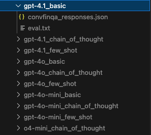

# ConvFinQA evaluation

## Overview

This guide provides instructions for setting up the evaluation pipeline for the ConvFinQA dataset.

The codebase preprocesses the data and uses the OpenAI API to generate responses to questions. It supports easy experimentation with different prompting strategies such as `chain-of-thought` and `few-shot learning`.


## Setup

### .env configuration

Firstly, please run the following command, this will enable you to configure your `.env` file with defaults that can be easily replaced.

```bashF
cp sample.env .env
```

The below table provides a brief summary of each environment variable 

| Variable            | Default Value                      | Type   | Description                                                            |
| ------------------- | ---------------------------------- | ------ | ---------------------------------------------------------------------- |
| `LOG_LEVEL`         | `INFO`                             | string | Sets the logging verbosity. Options: `DEBUG`, `INFO`, `WARN`, `ERROR`. |
| `OPENAI_API_KEY`    | `your_openai_api_key_here`         | string | Your OpenAI API key used to generate model responses.                  |
| `DATA_PATH`         | `/app/data/convfinqa_dataset.json` | string | Path to the ConvFinQA dataset JSON file.                               |
| `RANDOM_SEED`       | `42`                               | int    | Random seed for reproducible sampling and evaluation.                  |
| `MAX_RETRIES`       | `3`                                | int    | Number of retry attempts for failed API calls.                         |
| `BASE_DELAY`        | `2.0`                              | float  | Initial delay in seconds for exponential backoff.                      |

### Retry Configuration

The system includes exponential backoff retry logic for OpenAI API calls to handle rate limits and transient failures gracefully:

| Variable | Default Value | Type | Description |
|----------|---------------|------|-------------|
| `MAX_RETRIES` | `3` | int | Number of retry attempts for failed API calls |
| `BASE_DELAY` | `2.0` | float | Initial delay in seconds for exponential backoff |

#### Retry Schedule Example

With default settings (MAX_RETRIES=3, BASE_DELAY=2.0):

- **Attempt 1**: Immediate
- **Attempt 2**: Wait 2.0 seconds  
- **Attempt 3**: Wait 4.0 seconds
- **Attempt 4**: Wait 8.0 seconds

#### Retryable Errors

The system automatically retries the following OpenAI API errors:
- Rate limit exceeded (`RateLimitError`)
- API timeout (`APITimeoutError`) 
- General API errors (`APIError`)

Non-retryable errors (authentication, validation) fail immediately.

Configure these values in your `.env` file to handle different API rate limits and usage patterns.

### Configuration Management

The application uses Pydantic v2 for centralized configuration management. All environment variables are loaded and validated through the `Config` class in `app/config.py`. This provides:

- **Type Safety**: All configuration values are type-checked and validated
- **Default Values**: Sensible defaults are provided for all settings
- **Documentation**: Each configuration field includes a description
- **Validation**: Input validation ensures configuration integrity
- **Centralization**: Single source of truth for all application settings

The configuration is automatically loaded from the `.env` file and made available throughout the application via a global `config` instance.

### directory initialisation

Please run the following command to create an empty outputs directory, this will then be volume mapped inside your container, where it will later be populated with evaluation output files.

```bash
mkdir outputs
```

### Docker

In order to setup this repo, all thats needed are [docker](https://www.docker.com/) and [docker compose](https://docs.docker.com/compose/), these can be installed through the links or through a package manager such as homebrew or apt, for example:

```bash
brew install --cask docker
```

You can verify the installations with

```bash
docker --version
docker compose version
```

Once done, the application can be activated with:

```bash
docker compose up --build -d
```

### Aliases

A series of aliases are provided for convinience and ease of use. To activate these, from the project root run:

```bash
source .aliases
```

These aliases are summarised in the table below


| Alias         | Description                                      | Command                                                                                                                                                                               |
| ------------- | ------------------------------------------------ | ------------------------------------------------------------------------------------------------------------------------------------------------------------------------------------- |
| `format`      | Formats the code using `ruff`.                   | `docker compose exec app uvx ruff format .`                                                                                                                                           |
| `linting`     | Runs linting and auto-fixes issues using `ruff`. | `docker compose exec app uvx ruff check --fix .`                                                                                                                                      |
| `type-checks` | Performs static type checking with `mypy`.       | `docker compose exec app uvx mypy .`                                                                                                                                                  |
| `tests`       | Runs the test suite using `pytest`.              | `docker compose exec app uv run pytest tests/`                                                                                                                                        |
| `checks`      | Runs format, linting, type-checks, and tests.    | `format && linting && type-checks && tests`                                                                                                                                           |
| `pipeline`    | Runs the full CI/CD pipeline                     | `docker compose exec app uvx ruff format --check . && docker compose exec app uvx ruff check . && docker compose exec app uvx mypy . && docker compose exec app uv run pytest tests/` |


### Running the evaluations

To run an evaluation on the convfinqa dataset, using a given model and prompting stratergy, please run:

```bash
docker compose exec app uv run python src/main.py --model-name <model_name> --prompting-strategy <prompt_strategy> --sample-size <sample_size>  --use-seed <True/False>                                                                          
```

For simplicity, here is a quick example using gpt4o mini and a basic prompting stratergy and a sample size of 5, with use of a random seed:

```bash
docker compose exec app uv run python src/main.py --model-name gpt-4o-mini --prompting-strategy basic --sample-size 5 --use-seed True                                                                       
```


Each of the arguments, as well as there data type, default values, all valid values, and descriptions are given below: 


| Argument               | Type   | Default Value      | Acceptable Values                             | Description                                  |
| ---------------------- | ------ | ------------------ | --------------------------------------------- | -------------------------------------------- |
| `--model-name`         | string | `gpt-4.1`          | `gpt-4.1`, `gpt-4o`, `gpt-4o-mini`, `o4-mini` | Name of the LLM model to use.                |
| `--prompting-strategy` | string | `chain_of_thought` | `basic`, `chain_of_thought`, `few_shot`       | Prompting strategy to use.                   |
| `--sample-size`        | int    | `10`               | *(any positive integer)*                      | Number of samples to evaluate.               |
| `--use-train-data`     | bool   | `False`            | `True`, `False`                               | Use training data instead of the test set.   |
| `--use-seed`           | bool   | `True`             | `True`, `False`                               | Use a fixed random seed for reproducibility. |


### Outputs

When the evaluation is ran, a new directory will be created in the `/app/outputs `directory. If the `outputs` directory does not yet exist, it will also be created. The newly created directory, will have a dynamically created name, corresponding to the model ran and the prompting stratergy in the form:

`<model_name>_<prompting_stratergy>`

For example: if `gpt-4.1` was ran with a prompting stratergy of `basic`, the file name would be `gpt-4.1_basic`.

Inside the newly created directory 2 files are created. The first is a `.json` file, for each conversation evaluated, it contains details such as the conversation id, document, questions, and formatted LLM response. The second document is a `.txt` file, with summary information like sample size and LLM prediction accuracy. 

An example of the output structure with several dynamically created directories is shown below



### Evaluating all models and stratergies

A `.sh` script has been created, with a series of commands to evaluate all models with all stratergies. First run:

```bash
chmod +x run_models.sh
```

Then you can run:

```bash
./run_models.sh
```

## CI/CD

A CI/CD pipeline has been initialised, it will check any PRs into main for the following:

- correct formatting
- linting
- Type checking
- Check all tests pass

The `pipeline` alias replicates the CI/CD pipeline, running this alias is a simple check if a PR will pass the pipeline.


## Future work

The following points would be good next steps for further improve the codebase.

- Evaluation of models from other cloud providers such as Gemini and Claude
- Evaluation of opensource models, such as Llama and Mistral, can be done through Ollama or huggingface (highly dependent on compute resources)
- Expansion of evaluation framework, other methods are more comprehensive than direct string matching
- Additional prompt engineering, investigating how different templates can impact performance
- Add async/await support for concurrent API calls to improve performance
- Implement retry logic and rate limiting for robust API interactions
