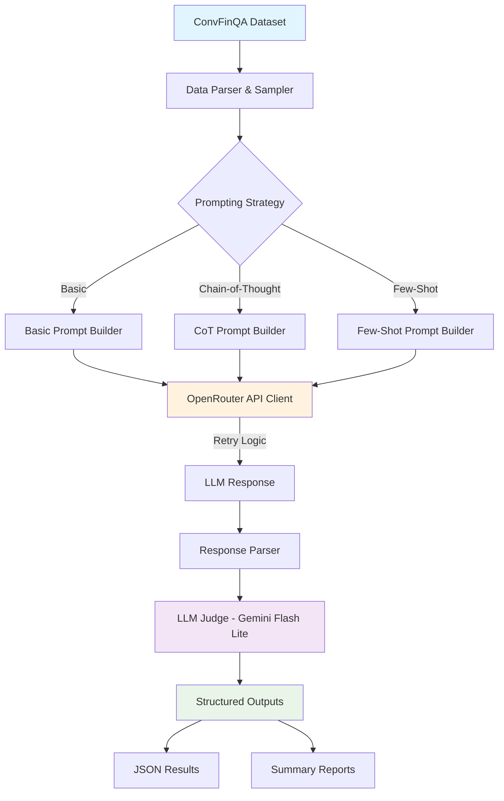

# ConvFinQA Evaluation Pipeline

[](https://www.python.org/downloads/)
[](https://github.com/astral-sh/uv)
[](https://github.com/astral-sh/ruff)
[](https://github.com/facebook/pyrefly)
[](https://github.com/pytest-dev/pytest)
[](https://github.com/features/actions)

## Overview

A reproducible evaluation framework for benchmarking Large Language Models on the **ConvFinQA** dataset - a conversational financial question-answering benchmark requiring multi-step reasoning across tabular data, introduced in [Chen et al. (2022)](https://arxiv.org/abs/2210.03849).

This pipeline evaluates models from OpenAI, Anthropic, and Google via **OpenRouter** using three distinct prompting strategies (`basic`, `chain-of-thought`, `few-shot`) with structured output generation and comprehensive accuracy metrics.

### Key Features

- **Multi-Provider Support**: Evaluate models from OpenAI, Anthropic, and Google via OpenRouter
- **Prompt Engineering**: Compare basic, chain-of-thought, and few-shot learning approaches
- **Reproducible Results**: Seeded sampling and containerised environment
- **Production Ready**: Type-safe configuration, exponential-backoff retry logic, structured logging
- **Comprehensive Testing**: Unit tests with pytest, linting with ruff, type checking with pyrefly

## Requirements

- [Docker](https://docs.docker.com/get-docker/) (v20.10+)
- [Docker Compose](https://docs.docker.com/compose/install/) (v2.0+)
- An [OpenRouter API key](https://openrouter.ai/keys) — used to access models from OpenAI, Anthropic, and Google via a single API

## Setup

1. Initialise the project — copies `sample.env` to `.env` and creates `data/`, `outputs/`, and `logs/` directories:
   ```bash
   make init
   ```
2. Open `.env` and set `OPENROUTER_API_KEY` to your OpenRouter API key.
3. Place the ConvFinQA dataset at `data/convfinqa_dataset.json`. Download it from the [official repository](https://github.com/czyssrs/ConvFinQA) — the file you need is `data/dev.json` from that repo; rename it to `convfinqa_dataset.json` and place it in the `data/` directory.
4. Build and start the container:
   ```bash
   docker compose up --build -d
   ```

## Running Checks

Source `.aliases` once in your shell, then use the shortcuts:

```bash
source .aliases
format       # ruff format + ruff check --fix
code-checks  # ruff format --check + ruff check + pyrefly
run-tests    # coverage run -m pytest + coverage report
pipeline     # code-checks + run-tests (exact mirror of CI)
all-checks   # format + code-checks + run-tests (use this locally before pushing)
```

Or run directly via `docker compose exec`:

```bash
docker compose exec app bash -ic "pipeline"
```

## Running Evaluations

```bash
docker compose exec app convfinqa --model-name <model> --prompting-strategy <strategy> --sample-size <n>
```

Example — `gemini-3.1-flash-lite-preview` with basic prompting, 5 samples:

```bash
docker compose exec app convfinqa --model-name google/gemini-3.1-flash-lite-preview --prompting-strategy basic --sample-size 5
```

| Argument               | Type   | Default                                | Acceptable Values                       | Description                                                        |
| ---------------------- | ------ | -------------------------------------- | --------------------------------------- | ------------------------------------------------------------------ |
| `--model-name`         | string | `google/gemini-3.1-flash-lite-preview` | See supported models table below        | Model to evaluate                                                  |
| `--prompting-strategy` | string | `basic`                                | `basic`, `chain_of_thought`, `few_shot` | Prompting strategy                                                 |
| `--sample-size`        | int    | `10`                                   | any positive integer                    | Number of samples                                                  |
| `--use-train-data`     | bool   | `False`                                | `True`, `False`                         | Use training set instead of test set                               |
| `--seed`               | int    | `None`                                 | any integer                             | Random seed for reproducible sampling (omit for non-deterministic) |

### Supported Models

| Model                                  | Provider  |
| -------------------------------------- | --------- |
| `openai/gpt-5.4-mini`                  | OpenAI    |
| `openai/gpt-5.5`                       | OpenAI    |
| `anthropic/claude-haiku-4.5`           | Anthropic |
| `anthropic/claude-sonnet-4.5`          | Anthropic |
| `anthropic/claude-sonnet-4.6`          | Anthropic |
| `google/gemini-3.1-pro-preview`        | Google    |
| `google/gemini-3.1-flash-lite-preview` | Google    |

Results are written to `outputs/<model>_<strategy>/`:
- `convfinqa_responses.json` — per-conversation details
- `eval.txt` — summary with accuracy

## Environment Variables

| Variable             | Default                | Description                                                                                          |
| -------------------- | ---------------------- | ---------------------------------------------------------------------------------------------------- |
| `OPENROUTER_API_KEY` | *(required)*           | Your OpenRouter API key — grants access to all supported providers (OpenAI, Anthropic, Google, etc.) |
| `MAX_RETRIES`        | `10`                   | Retries for both pydantic-ai tool/validation attempts and OpenAI SDK HTTP retries (429 / 5xx)        |
| `UID`                | *(set by `make init`)* | Host user ID — aligns container's non-root user with host                                            |
| `GID`                | *(set by `make init`)* | Host group ID — aligns container's non-root group with host                                          |

## Results

All results below use a fixed random seed (`--seed 42`) and `--sample-size 25` on the dev set.

<div align="center">

| Model                 | Basic (%) | Chain-of-Thought (%) | Few-Shot (%) | **Best (%)** |
| --------------------- | --------- | -------------------- | ------------ | ------------ |
| **claude-sonnet-4.5** | 74.63     | 72.63                | **78.63**    | **78.63**    |
| gemini-3.1-pro        | **77.50** | 73.59                | 77.06        | **77.50**    |
| gpt-5.5               | 74.16     | 74.16                | 72.83        | **74.16**    |
| claude-haiku-4.5      | 60.86     | 56.90                | **71.59**    | **71.59**    |
| gemini-3.1-flash-lite | 57.39     | 58.86                | **71.72**    | **71.72**    |
| gpt-5.4-mini          | 60.26     | 65.82                | **67.26**    | **67.26**    |

</div>

> **Key Insights**:
> - **Few-shot is the dominant strategy** — it wins or ties for best in 5 out of 6 models.
> - **claude-sonnet-4.5** achieves the highest overall accuracy at **78.63%** with few-shot prompting.
> - **Budget models punch above their weight** — both `claude-haiku-4.5` and `gemini-3.1-flash-lite` reach ~72% with few-shot, closely matching the flagship models at a fraction of the cost.
> - **gpt-5.5 is strategy-insensitive** — nearly identical scores across all three prompting approaches.

**Performance Comparison**: The chart below shows accuracy across all model-strategy combinations.


*Full results and analysis available in [REPORT.md](REPORT.md)*

## CI

GitHub Actions runs on every pull request and push to `main`. The workflow builds the dev container and runs the `pipeline` alias inside it:

```
pipeline = code-checks + run-tests
```

Because CI uses the same container and aliases you run locally, there is no drift. If `all-checks` passes locally, CI will pass.

To gate merges on CI, enable branch protection on `main` and require the `checks` status check to pass before merging.

## Architecture & Design

### System Overview


```mermaid
flowchart TD
    A[ConvFinQA Dataset] --> B[Data Parser & Sampler]
    B --> C{Prompting Strategy}
    C -->|Basic| D1[Basic Prompt Builder]
    C -->|Chain-of-Thought| D2[CoT Prompt Builder] 
    C -->|Few-Shot| D3[Few-Shot Prompt Builder]
    D1 --> E[OpenRouter API Client]
    D2 --> E
    D3 --> E
    E -->|Retry Logic| F[LLM Response]
    F --> G[Response Parser]
    G --> H[LLM Judge - Gemini Flash Lite]
    H --> I[Structured Outputs]
    I --> J[JSON Results]
    I --> K[Summary Reports]
    
    style A fill:#e1f5fe
    style E fill:#fff3e0
    style H fill:#f3e5f5
    style I fill:#e8f5e8
```

<details>
<summary>If the diagram above doesn't display properly, click here for a text version</summary>

> **Note**: Some markdown previewers don't support Mermaid diagrams. Here's the same system flow in text format:

```
ConvFinQA Dataset
        ↓
Data Parser & Sampler
        ↓
   Prompting Strategy
    ↙    ↓    ↘
Basic   CoT   Few-Shot
   ↘     ↓     ↙
   OpenRouter API Client
     (with retry logic)
         ↓
   LLM Response
         ↓
  Response Parser
         ↓
 LLM Judge (Gemini Flash Lite)
     ↓ concurrent, max 5 at once
 Structured Outputs
    ↙        ↘
JSON Results  Summary Reports
```

</details>

### Module Structure

The pipeline is organised as a flat package with a single privileged core module:

- **`app/models.py`** — innermost dependency; defines all shared domain types (`ConvQA`, `FinancialDoc`, `ModelName`, `PromptingStrategy`). Imports only stdlib and pydantic — no other app module imports from here flow back into it.
- **`app/log.py`** — logging setup; `configure_logging()` called once from `main.py`
- **`app/agent.py`** / **`app/judge.py`** — LLM client wiring via pydantic-ai + OpenRouter
- **`app/generate_responses.py`** / **`app/evaluator.py`** — pipeline orchestration; both receive pre-built agents via constructor injection
- **`app/data_parser.py`** / **`app/prompting.py`** / **`app/results_writer.py`** — data ingestion, prompt construction, output persistence
- **`app/tools.py`** — 7 arithmetic tools registered on the agent
- **`app/settings.py`** — pydantic-settings config, `@lru_cache`
- **`app/main.py`** — CLI entry point (typer); builds agents and wires all components

### Prompting Strategies

- **Basic**: Minimal prompt serving as baseline performance
- **Chain-of-Thought**: Step-by-step reasoning before final answers  
- **Few-Shot**: Example-driven learning focusing on output formatting

### Evaluation Methodology

- **Accuracy Metric**: LLM-as-judge (Gemini Flash Lite) evaluates semantic equivalence per answer pair, handling numeric formatting differences and rounding variations
- **Reproducible Sampling**: Configurable sample sizes with optional seeding
- **Structured Outputs**: JSON format with conversation metadata and evaluation results

### Sequential Processing

Conversations are processed one at a time during the generation phase. This is a deliberate design decision driven by how tool-equipped agents work.

Unlike plain text generation (1 request per conversation), each conversation here involves a back-and-forth tool call loop:

1. Prompt sent → model decides to call a tool (e.g. `subtract`)
2. Tool result returned → model decides to call another tool (e.g. `percentage_change`)
3. Loop continues until the model produces its final structured output

A single multi-question conversation can make up to **25 requests** (`request_limit=25`). Running even 3 conversations concurrently could produce up to **75 simultaneous requests**, which would saturate most standard API rate limit quotas immediately.

The problem compounds under concurrency — once the rate limiter fires, all concurrent conversations enter backoff simultaneously. When the backoff expires they all retry at once, hitting the rate limiter again. This thundering-herd cycle wastes more time in backoff than sequential processing would have taken in the first place.

Two retry layers guard against rate limits during sequential processing:
- **SDK-level** (`openai` client `max_retries`): retries 429s and 5xx errors silently with its own backoff — never visible in logs
- **Outer loop** (`get_response`): catches `RateLimitError` after the SDK gives up, applying exponential backoff (1s → 2s → 4s → 8s…) up to `MAX_RETRIES` attempts before re-raising

Both layers must be exhausted before a rate limit error actually propagates — in practice this means the pipeline is highly resilient to sustained rate limiting.

The evaluation (judge) phase runs concurrently, capped at 5 simultaneous calls via `asyncio.Semaphore`. Judge calls are safe to parallelise because each is a single request with no tool calls — the request count per conversation is fixed and small.

## Future Work

The following enhancements would further improve the codebase:

- **Open Source Models**: Integration with Llama and Mistral via Ollama or HuggingFace
- **Advanced Prompting**: Template experimentation and prompt optimisation

## Contributing

1. Clone the repository
2. Create a feature branch (`git checkout -b feature/amazing-feature`)
3. Make your changes and ensure tests pass (`all-checks`)
4. Commit your changes (`git commit -m 'Add amazing feature'`)
5. Push to the branch (`git push origin feature/amazing-feature`)
6. Open a Pull Request
