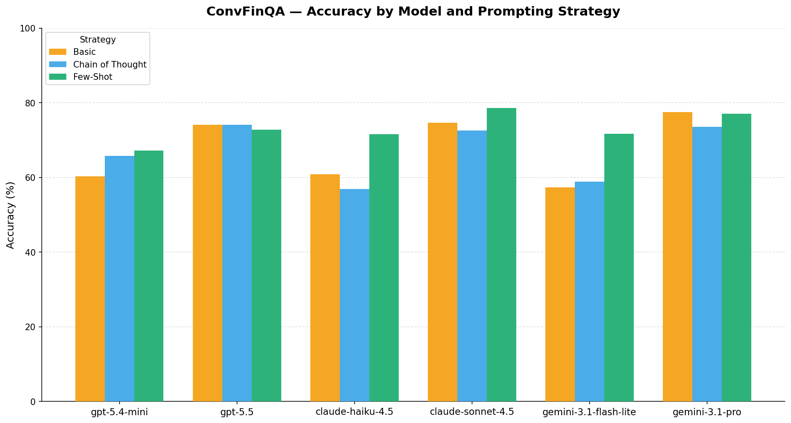
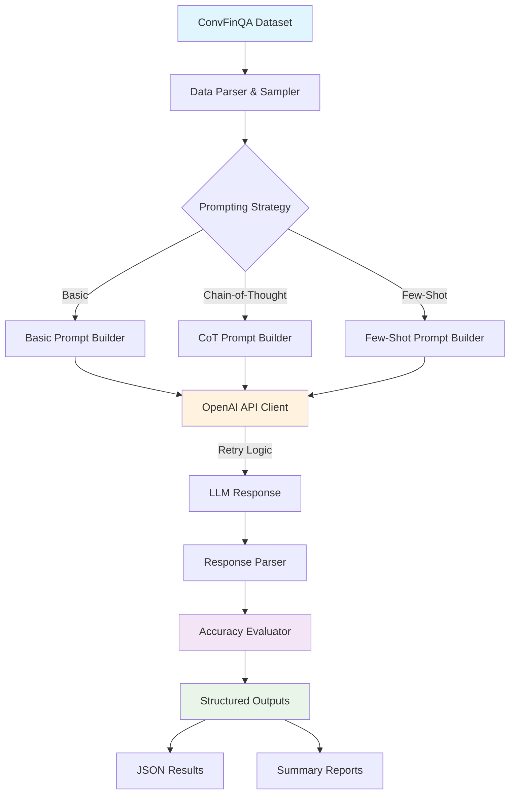

# ConvFinQA Evaluation Pipeline

[](https://www.python.org/downloads/)
[](https://github.com/astral-sh/uv)
[](https://github.com/astral-sh/ruff)
[](https://github.com/facebook/pyrefly)
[](https://github.com/pytest-dev/pytest)
[](https://github.com/features/actions)
[](https://opensource.org/licenses/MIT)

## Overview

A reproducible evaluation framework for benchmarking Large Language Models on the **ConvFinQA** dataset - a conversational financial question-answering benchmark requiring multi-step reasoning across tabular data.

This pipeline evaluates models from OpenAI, Anthropic, and Google via **OpenRouter** using three distinct prompting strategies (`basic`, `chain-of-thought`, `few-shot`) with structured output generation and comprehensive accuracy metrics.

### Key Features

- **Multi-Provider Support**: Evaluate models from OpenAI, Anthropic, and Google via OpenRouter
- **Prompt Engineering**: Compare basic, chain-of-thought, and few-shot learning approaches
- **Reproducible Results**: Seeded sampling and containerised environment
- **Production Ready**: Type-safe configuration, exponential-backoff retry logic, structured logging
- **Comprehensive Testing**: Unit tests with pytest, linting with ruff, type checking with pyrefly

## Setup

1. Initialise the project — copies `sample.env` to `.env` and creates `data/`, `outputs/`, and `logs/` directories:
   ```bash
   make init
   ```
2. Open `.env` and set `OPENROUTER_API_KEY` to your actual OpenRouter API key.
3. Place the ConvFinQA dataset at `data/convfinqa_dataset.json`.
4. Build and start the container:
   ```bash
   docker compose up --build -d
   ```

## Running Checks

Source `.aliases` once in your shell, then use the shortcuts:

```bash
source .aliases
format       # ruff format + ruff check --fix
code-checks  # ruff format --check + ruff check + pyrefly
run-tests    # coverage run -m pytest + coverage report
pipeline     # code-checks + run-tests (exact mirror of CI)
all-checks   # format + code-checks + run-tests (use this locally before pushing)
```

Or run directly via `docker compose exec`:

```bash
docker compose exec app bash -ic "pipeline"
```

## Running Evaluations

```bash
docker compose exec app convfinqa --model-name <model> --prompting-strategy <strategy> --sample-size <n>
```

Example — `gpt-4o-mini` with basic prompting, 5 samples:

```bash
docker compose exec app convfinqa --model-name gpt-4o-mini --prompting-strategy basic --sample-size 5
```

| Argument               | Type   | Default            | Acceptable Values                       | Description                           |
| ---------------------- | ------ | ------------------ | --------------------------------------- | ------------------------------------- |
| `--model-name`         | string | `openai/gpt-4.1`   | See supported models table below        | Model to evaluate                     |
| `--prompting-strategy` | string | `chain_of_thought` | `basic`, `chain_of_thought`, `few_shot` | Prompting strategy                    |
| `--sample-size`        | int    | `10`               | any positive integer                    | Number of samples                     |
| `--use-train-data`     | bool   | `False`            | `True`, `False`                         | Use training set instead of test set  |
| `--use-seed`           | bool   | `True`             | `True`, `False`                         | Fixed random seed for reproducibility |

### Supported Models

| Model | Provider |
| ----------------------------------------- | --------- |
| `openai/gpt-4.1`                          | OpenAI    |
| `openai/gpt-4o`                           | OpenAI    |
| `openai/gpt-4o-mini`                      | OpenAI    |
| `openai/o4-mini`                          | OpenAI    |
| `openai/gpt-5.4`                          | OpenAI    |
| `openai/gpt-5.4-mini`                     | OpenAI    |
| `openai/gpt-5.5`                          | OpenAI    |
| `anthropic/claude-sonnet-4.5`             | Anthropic |
| `anthropic/claude-sonnet-4.6`             | Anthropic |
| `google/gemini-3.1-pro`                   | Google    |
| `google/gemini-3.1-flash-lite`            | Google    |

Results are written to `outputs/<model>_<strategy>/`:
- `convfinqa_responses.json` — per-conversation details
- `eval.txt` — summary with accuracy

## Environment Variables

| Variable             | Default                        | Description                                                                                          |
| -------------------- | ------------------------------ | ---------------------------------------------------------------------------------------------------- |
| `OPENROUTER_API_KEY` | *(required)*                   | Your OpenRouter API key — grants access to all supported providers (OpenAI, Anthropic, Google, etc.) |
| `DATA_PATH`          | `/data/convfinqa_dataset.json` | Path to dataset inside the container                                                                 |
| `MAX_RETRIES`        | `10`                           | Retries for both pydantic-ai tool/validation attempts and OpenAI SDK HTTP retries (429 / 5xx)        |
| `UID`                | *(set by `make init`)*         | Host user ID — aligns container's non-root user with host                                            |
| `GID`                | *(set by `make init`)*         | Host group ID — aligns container's non-root group with host                                          |

<div align="center">

| Model       | Best Strategy | Accuracy (%) | Sample Size |
| ----------- | ------------- | ------------ | ----------- |
| **o4-mini** | Few-Shot      | **54.15**    | 20          |
| gpt-4.1     | Few-Shot      | 49.13        | 50          |
| gpt-4o      | Few-Shot      | 35.30        | 50          |
| gpt-4o-mini | Few-Shot      | 22.25        | 50          |

</div>

> **Key Insight**: o4-mini significantly outperforms all other models, achieving 54.15% accuracy - over 2x better than gpt-4o-mini and 5% higher than gpt-4.1.

**Performance Comparison**: The chart below shows accuracy across all model-strategy combinations, highlighting Few-Shot learning's consistent superiority and o4-mini's unexpected strong performance.



*Full results and analysis available in [REPORT.md](REPORT.md)*

## CI

GitHub Actions runs on every pull request and push to `main`. The workflow builds the dev container and runs the `pipeline` alias inside it:

```
pipeline = code-checks + run-tests
```

Because CI uses the same container and aliases you run locally, there is no drift. If `all-checks` passes locally, CI will pass.

To gate merges on CI, enable branch protection on `main` and require the `checks` status check to pass before merging.

## Architecture & Design

### System Overview


```mermaid
flowchart TD
    A[ConvFinQA Dataset] --> B[Data Parser & Sampler]
    B --> C{Prompting Strategy}
    C -->|Basic| D1[Basic Prompt Builder]
    C -->|Chain-of-Thought| D2[CoT Prompt Builder] 
    C -->|Few-Shot| D3[Few-Shot Prompt Builder]
    D1 --> E[OpenAI API Client]
    D2 --> E
    D3 --> E
    E -->|Retry Logic| F[LLM Response]
    F --> G[Response Parser]
    G --> H[Accuracy Evaluator]
    H --> I[Structured Outputs]
    I --> J[JSON Results]
    I --> K[Summary Reports]
    
    style A fill:#e1f5fe
    style E fill:#fff3e0
    style H fill:#f3e5f5
    style I fill:#e8f5e8
```

<details>
<summary>If the diagram above doesn't display properly, click here for a text version</summary>

> **Note**: Some markdown previewers don't support Mermaid diagrams. Here's the same system flow in text format:

```
ConvFinQA Dataset
        ↓
Data Parser & Sampler
        ↓
   Prompting Strategy
    ↙    ↓    ↘
Basic   CoT   Few-Shot
   ↘     ↓     ↙
   OpenAI API Client
    (with retry logic)
        ↓
   LLM Response
        ↓
  Response Parser
        ↓
 Accuracy Evaluator
        ↓
 Structured Outputs
    ↙        ↘
JSON Results  Summary Reports
```

</details>

### Prompting Strategies

- **Basic**: Minimal prompt serving as baseline performance
- **Chain-of-Thought**: Step-by-step reasoning before final answers  
- **Few-Shot**: Example-driven learning focusing on output formatting

### Evaluation Methodology

- **Accuracy Metric**: Two-stage matching — exact string first, then numeric-tolerant fallback (unicode minus normalisation, `%` vs decimal alignment, 1% relative tolerance)
- **Reproducible Sampling**: Configurable sample sizes with optional seeding
- **Structured Outputs**: JSON format with conversation metadata and evaluation results

### Sequential Processing

Conversations are processed one at a time despite the pipeline being `async`. Each conversation is inherently sequential — the model must wait for each tool call result before deciding the next step, so there is no parallelism to exploit within a conversation. Across conversations, `asyncio.gather` with a semaphore could run multiple concurrently, but this is not implemented because OpenRouter's rate limits are saturated even with a single conversation in-flight. Adding concurrency would increase 429 errors without improving throughput. This should be revisited if the rate limit ceiling is raised.

## Future Work

The following enhancements would further improve the codebase:

- **Open Source Models**: Integration with Llama and Mistral via Ollama or HuggingFace
- **Performance Optimisation**: Concurrent conversation processing via `asyncio.gather` with a semaphore — currently blocked by OpenRouter rate limits, which are saturated even with sequential processing. Concurrency would only help once throughput limits are no longer the bottleneck.
- **Advanced Prompting**: Template experimentation and prompt optimisation

## License

This project is licensed under the MIT License - see the [LICENSE](LICENSE) file for details.

## Contributing

1. Fork the repository
2. Create a feature branch (`git checkout -b feature/amazing-feature`)
3. Make your changes and ensure tests pass (`all-checks`)
4. Commit your changes (`git commit -m 'Add amazing feature'`)
5. Push to the branch (`git push origin feature/amazing-feature`)
6. Open a Pull Request
