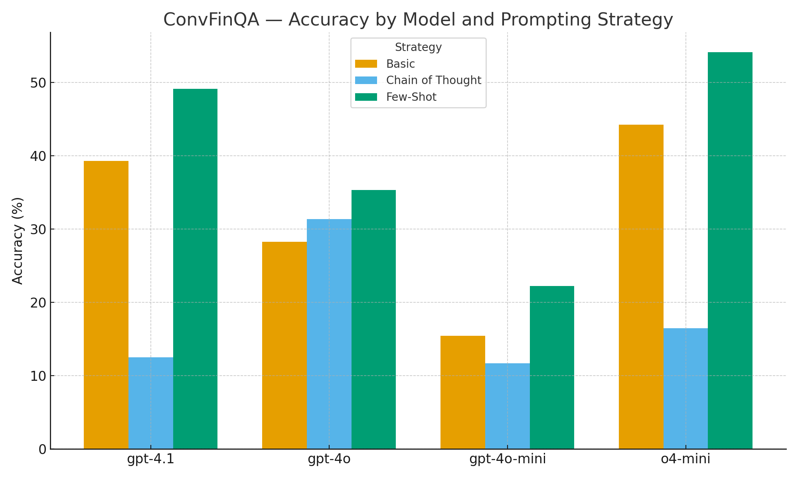

# ConvFinQA Report

## Overview

I investigate a range of prompting stratergies applied to several of OpenAI's proprietary LLMs on the ConvFinQA dataset. This is a conversational dataset with each entry containing a document featuring a table alongside some additional information. Each conversation contains a series of questions, often the answer to one question can inform the answer to a subsequent question, thus requiring complesophisticated reasoning from an LLM agent to generate correct responses.

## Method and architecture

### Parsing the dataset

A `ConvFinQaDataParser` class is used to iterate through each conversetion in the ConvFinQa dataset. For each conversation, a dataclass instance is created containing key information about the conversation, such as its id, the document, the questions, and the answers. The final output is a list of these `ConvQA` dataclasses representing the train or test dataset.

### prompt engineering

The prompting is generated using an abstract base class classed `PromptStrategy` as a blueprint. There are then a set of 3 concrete implementations, with each representing a different prompting stratergy. The `BasicPromptStrategy` subclass used a basic prompt to be used as a baseline, telling the LLM its role and instructing it on its relevant input and output formats, then leaving the agent to figure out the details on its own. The `ChainOfThoughtPromptStrategy` utilised a chain-of-thought (COT) prompt pattern, requiring the LLM to clearly layout its reasoning step by step before generating an answers in a single clear list of python strings. The `FewShotPromptStrategy` approach utilised examples to help the agent correctly answer. During my initial experimentation, I noticed often a major limitation of the LLM was not its ability to generate correct answers, but rather its ability to format them in a way that preciseley matches the target answer. As such my fewshot learning examples didnt focous on the document and reasoning, instead they focoused on the mapping of inputs to outputs in the correct form.

### Generating LLM responses

The `GetLlmResponse` class is an Abstract base class, providing an interface for any concrete implementations which take in specific model names as inputs and utilise http requests to an API to generate LLM responses. The `OpenAiLlmResponse` is one such implementation, it is initialised with the name of an LLM model, checks if it matches one of the values in the `ModelName` enums, if not raising a value error. Provided the class is correctly initialised, it's `get_response` method can take in a prompt which has some prompt stratergy, alongside a document and some questions, and use these to generate a response.

The `OpenAiLlmResponse` class is currently configured to support the following LLMs.

- `gpt-4.1` 
- `gpt-4o`
- `gpt-4o-mini` 
- `o4-mini`

The `GetAllLlmResponses` class takes in a model type from the list above, alongside a prompting stratergy. It is also able to specify if the training or evaluation dataset should be used, the dataset is then parsed using the `ConvFinQaDataParser` to get a list of `ConvQA` dataclass instances. Each of these `ConvQA` instances is iterated through, and the document and questions are jointly used alongside the prompting stratergy to generate an LLM response. The class also contains an argument to do sampling of the entire dataset, this is done to reduce compute time and token useage, a random seet can also be set as an argument for reproducability. The `GetAllLlmResponses` class contains a `extract_list_from_llm_response` method, this takes the entire string output from a prompt response, and extracts just the final list of strings. 

E.g. given a response of: `the correct answers are ['12', '-8', '£16']`

The method will return a list of `['12', '-8', '£16']`

For each set of questions evaluated in a conversation, the extracted list from the LLM response is appended to the corresponding ConvQA dataclass instance.

### Evaluating responses

Each dataclass instance of `ConvQA` represents a single conversation, these are all processed by the `GetAllLlmResponses` class. The LLM outputs for each conversation are appended to the corresponding dataclass instance of `ConvQA`. The `ConvQA` class now contains correct answers and formatted answers both as lists, iterating through both pairs of lists, the answers can be compared elementwise. If the strings match exactly, the prediction is marked as correct, if not, the prediction is marked as false. In practice this evaluation mechanism can lead to responses which are incredibly similar being marked as different, as discussed in the Error Analysis section. Each set of correct and predicted elements are compared for each conversation, and these are used to compute accuracy.

### Results

In total 4 LLM agents were evaluated with 3 prompting stratergies each, the following models were all evaluated on sample sizes of 50 conversations: `gpt-4.1``gpt-4o``gpt-4o-mini`. Whilst the `o4-mini` model used a sample size of 20, due to greater latencies and token costs.

| Model       | Prompting Strategy | Accuracy (%) |
| ----------- | ------------------ | ------------ |
| gpt-4.1     | Basic              | 39.27        |
| gpt-4.1     | Chain of Thought   | 12.53        |
| gpt-4.1     | Few-Shot           | 49.13        |
| gpt-4o      | Basic              | 28.29        |
| gpt-4o      | Chain of Thought   | 31.37        |
| gpt-4o      | Few-Shot           | 35.30        |
| gpt-4o-mini | Basic              | 15.43        |
| gpt-4o-mini | Chain of Thought   | 11.67        |
| gpt-4o-mini | Few-Shot           | 22.25        |
| o4-mini     | Basic              | 44.23        |
| o4-mini     | Chain of Thought   | 16.50        |
| o4-mini     | Few-Shot           | 54.15        |

**Visual Performance Analysis**: The chart below provides a comprehensive view of all model-strategy combinations, clearly illustrating the performance patterns across the evaluation.

**Key Observations**:
- **Few-Shot learning consistently outperforms** other strategies across all models, demonstrating the importance of structured examples for financial QA tasks
- **o4-mini emerges as the top performer**, achieving 54.15% accuracy with Few-Shot prompting - significantly higher than other models
- **Chain-of-Thought shows mixed results**, performing well with gpt-4o (31.37%) but poorly with other models, suggesting model-specific optimization needs
- **Performance hierarchy**: o4-mini > gpt-4.1 > gpt-4o > gpt-4o-mini, indicating that model size and architecture matter significantly for this task

### Outputs

When the `ConversationsEvaluator` is ran, a new directory will be created in the `/app/outputs `directory. If the `outputs` directory does not yet exist, it will also be created. The newly created directory, will have a dynamically created name, corresponding to the model ran and the prompting stratergy in the form:

`<model_name>_<prompting_stratergy>`

For example: if `gpt-4.1` was ran with a prompting stratergy of `basic`, the file name would be `gpt-4.1_basic`.

Inside the newly created directory 2 files are created. The first is a `.json` file, for each conversation evaluated, it contains details such as the conversation id, document, questions, and formatted LLM response. The second document is a `.txt` file, with summary information like sample size and LLM prediction accuracy. 

An example of the output structure with several dynamically created directories is shown below

## Error Analysis

Upon investigation, the vast majority of error cases appear to come from the LLMs responses not being an exact match to those in the correct answers lists, this will often be too trivial differences such as rounding, or inconsistent use of symbols like $ and % sometimes but not always. 

For example, here was a set of correct answers: `["3200", "3160", "40", "1.3%"]`

And here were the llms predictions: `["3200.0", "3160.0", "40.0", "1.27%"]`

here the LLm was conceptually correct for all questions, yet due to not giving the answers with the same level of precision, all 4 will be marked incorrect and the LLM has effectiveley achieved a 0% accuracy score for this question. This shows how direct string matching can lead to the performance of the LLMs being heavily understated.

## Future Work 

- Evaluation of models from other cloud providers such as Gemini and Claude
- Evaluation of opensource models, such as Llama and Mistral, can be done through Ollama or huggingface (highly dependent on compute resources)
- Expansion of evaluation framework, other methods are more comprehensive than direct string matching, such as:
  - setting a tolorance (if off by less than some small amount treat the answer as correct)
  - Make the responses insensitive to units, remove % and £ symbols ect.
  - get embeddings and take cosine similarity
- Additional prompt engineering, seeing how different templates can impact performanc
